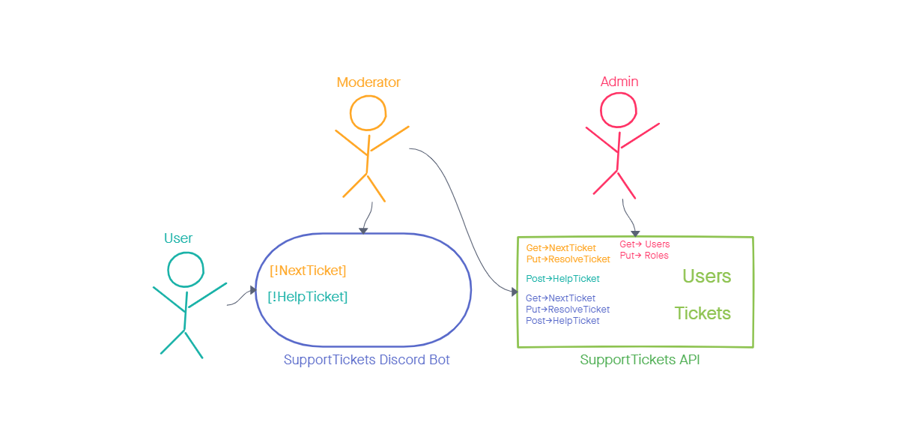
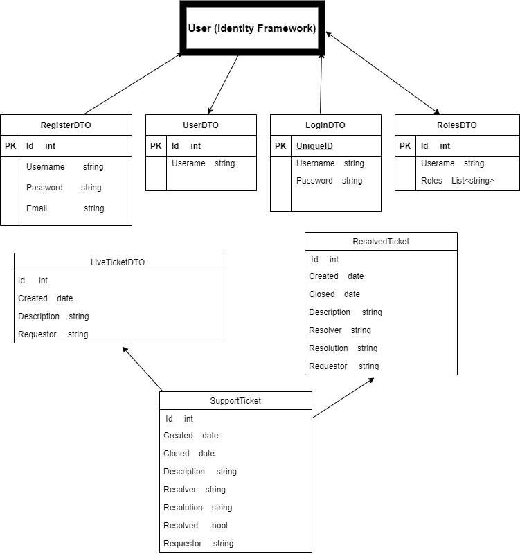

# Bot Builder

> This solution is a bot created for midterm projects. 
> Live demo [_here_](https://www.example.com).

## Table of Contents

* [General Info](#general-information)
* [Technologies Used](#technologies-used)
* [Features](#features)
* [Images](#screenshots)
* [Setup](#setup)
* [Usage](#usage)
* [Project Status](#project-status)
* [Room for Improvement](#room-for-improvement)
* [Acknowledgements](#acknowledgements)
* [Contact](#contact)
* [License](#license)
* [Other Docs](#links)

## General Information

* Create a Bot for discord that allows members of a specific server add tickets with problems to be resolved.
* Those tickets will be added to a restful API server.

## Technologies Used

* C# 9.0
* ASP.NET 5.0
* Discord.Net
* Entity Framework
* Identity Framework

## Features

List the ready features here:

* 

## Images

**Domain Model**

**ERD**

## Setup

Fill later

## Usage

Fill later

## Project Status

Project is: in progress

## Room for Improvement

Room for improvement:

* Improvement to be done 1
* Improvement to be done 2

To do:

* Feature to be added 1
* Feature to be added 2

## Acknowledgements

### Authors

* **Steven Boston**
* **Charles Bofferding**
* **Joshua Haddock**

Co-Contributors

* 

## Contact

Created by

- [Joshua Haddock](https://www.linkedin.com/in/joshuahaddock/)
- [Steven Boston](https://www.linkedin.com/in/steven-boston/)
- [Charles Bofferding](https://www.linkedin.com/in/charles-bofferding/)

feel free to contact any of us via the above links

## License

This project is open source and available under the [MIT License](./LICENSE).

## Other Links

* [Project Pitch](./ProjectPitch.md)
* [Team Agreements](./TeamAgreements.md)
